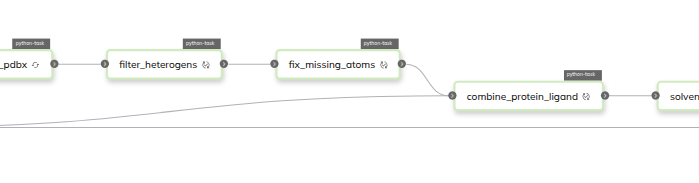

<h3>Introduction</h3>

As part of my current internship, we are working on Flyte workflows to perform short molecular dynamics (MD) simulations for parameterized and solvated ligands derived from SMILES strings. This effort is part of a broader initiative to develop a framework for cloud based computational workflows, including Molecular Dynamics simulations which are highly sought after. Here I will summarize some key steps and challenges to setting up MD simulations for protein-ligand complexes using open source tools. 

<h3>Project Scope and Objectives</h3>

The primary goal is to automate the process of setting up and running MD simulations for small molecules in solution, with the long-term aim of integrating these results into free energy calculations. By leveraging Flyte, a workflow automation platform, and Kubernetes cluster deployment, we aim to ensure scalable, reproducible, and efficient simulations. The workflow begins by parsing a SMILES string to generate molecular structures, followed by parameterizing the ligand using appropriate force fields. After parameterization, the system is solvated and equilibrated before running a short MD simulation to sample conformations. Finally, the results are stored and analyzed for further free energy estimation. The framework developed aims to provide a rigorous and applicable workflow to a wide range of protein-ligand complexes to provide pathways for seamlessly optimizing lead compounds.

<h3>Open Source vs Proprietary tools available</h3>

A key consideration in setting up MD simulations and free energy calculations is the choice between open-source and proprietary software. Open-source tools, such as OpenMM, Ambertools, and OpenFF provide flexibility, transparency, and cost-effectiveness, making them widely used in academic and research settings. They offer extensive community support and continuous development but may require additional effort in setup and maintenance. Proprietary solutions, such as Schrödinger's Desmond or AMBER, often provide more streamlined workflows with vendor support, optimised performance, and additional validation. However, they come with licensing costs and potential restrictions on customisation. This project primarily focuses on open-source implementations to ensure accessibility and adaptability.

<figure>
    
    <figcaption>Snippet of an energy minimization workflow diagram</figcaption>
</figure>
<h3>Progress and Achievements</h3>

Significant progress has been made in designing and implementing the workflow. The initial workflow design has been outlined, breaking down the process into modular Flyte tasks. The conversion of SMILES strings into 3D molecular structures has been successfully implemented using cheminformatics tools. Additionally, preliminary workflows for assigning force fields to ligands have been established. The workflow also integrates steps for solvating and equilibrating the molecular system prior to simulation. A short MD simulation pipeline has been configured to ensure compatibility with Flyte’s execution model, and initial runs have been conducted to validate the correctness of input preparation and simulation stability.

Several challenges have been encountered throughout the development process. Managing computational resources efficiently while maintaining scalability is a key concern. Ensuring accurate parameterization of ligands, particularly for molecules with unusual functional groups, has required careful selection and combination of force fields, and handling of exceptions. Optimizing the workflow to reduce the inputs from the user, allowing for a more hands-off approach from the user. Additionally, planning how best to integrate MD results into free energy calculations remains an important consideration moving forward.

<h3>Future Directions</h3>

In the next stages of development, I plan to optimize workflow efficiency by streamlining data handling and improving automation and error-handling mechanisms. Expanding parameterization support to cover a wider range of molecules will be an important step toward increasing the robustness of the workflow. Further validation of simulation outputs against experimental or high-quality computational benchmarks will help ensure reliability. Post-processing steps will also be integrated to extract relevant thermodynamic quantities, enhancing the overall predictive power of the approach.

<h3>Other Projects</h3>
{: .t60 }

