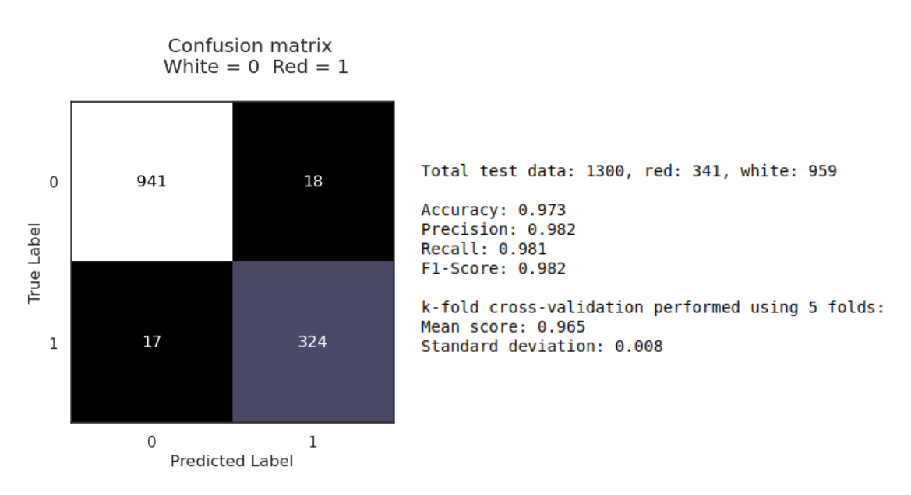
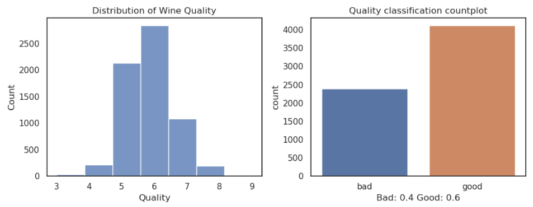
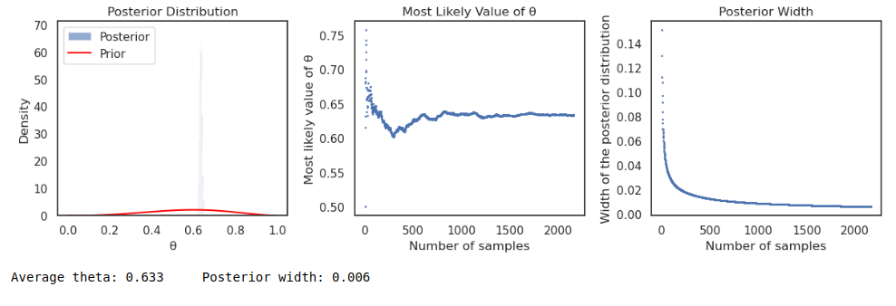
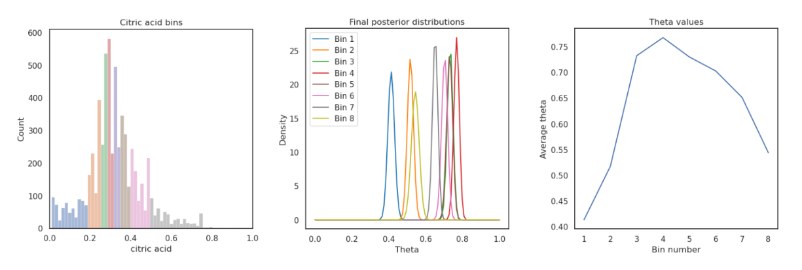

### The Dataset

For this project, I used the "wine-dataset" sourced from the UCI machine learning repository. The dataset contains 6497 samples, each representing a different wine. The dataset has 12 features, including physiochemical properties such as fixed acidity, volatile acidity, citric acid, residual sugar, chlorides, free sulfur dioxide, total sulfur dioxide, density, pH, sulphates, and alcohol content. Additionally, the dataset provides a quality score ranging from 0 to 9, with higher scores indicating better quality, although the lowest score given is 3.

### The Objective

The project aimed to address two key questions:

- Can we classify wines as red or white based on their chemical properties?  

- Can we predict the "goodness" of wines?

- How do we make better wines?

Binary logistic regression was chosen to classify the wines. To explore the latter question, I used Bayesian inference to investigate the relationship between the physiochemical properties and the probability of a wine being classified as "good," based on the quality score.

### The Results! 

- A binary logistic regression (BLR) model was constructed to predict wine type using six variables. The model achieved 97.3% accuracy, with precision, recall, and F1 scores all above 98%. Five-fold cross-validation showed consistent performance across different subsets of the data.

- Bayesian inference was used to estimate the probability of a wine being classified as "good" based on a quality score threshold of six. The average probability (theta) was found to be 63%, with a narrow posterior distribution indicating high confidence in the estimate.

- The relationship between citric acid concentration and the probability of a wine being "good" was investigated using Bayesian inference. The results showed that wines with citric acid levels between 0.29 and 0.34 g.dm-3 had the highest probability of being rated as "good". This suggests that winemakers could aim for this citric acid range to increase the likelihood of producing high-quality wines.

### Techincal details
##### Data exploration, cleaning and preprocessing
Before diving into modelling, I preprocessed the data to ensure its quality and suitability for analysis. This involved handling missing values (if any), addressing potential outliers, and scaling numerical features to a standard range. Additionally, I encoded the wine type (red or white) as a binary variable for use in logistic regression.

##### Logistic regression
Logistic regression is a suitable algorithm for binary classification tasks, making it a good choice for predicting wine type. Using Recursive Feature Elimination (RFE) with logistic regression, I selected six features for the model: chlorides, residual sugar, fixed acidity, volatile acidity, pH, and sulphates.

    

The model achieved an impressive accuracy of 97.3% on the test data, demonstrating its effectiveness in distinguishing between red and white wines. Further evaluation using precision, recall, and F1-score all yielded values above 98%, indicating a high level of confidence in the model's predictions. The confusion matrix visually confirmed the model's performance, showing a low number of misclassifications. Finally, the ROC curve, with an area under the curve (AUC) of 0.97, reinforces the model's excellent discriminatory ability. Furthermore, the model showed to be robust with a k-fold cross-val score of 0.97 using 5 folds, suggesting little variation in accuracy for new sets of data.

While logistic regression is a powerful tool, it has some limitations. It assumes a linear relationship between the independent variables and the logit of the dependent variable, which may not always hold true. Additionally, it requires careful handling of multicollinearity, which I addressed through feature selection.

##### Bayesian inference - Good or Bad wine?
To gain a deeper understanding of wine quality, I turned to Bayesian inference. This approach allows us to incorporate prior knowledge and update our beliefs about the probability of a wine being "good" as we observe more data.

    

For this analysis, I defined a wine as "good" if its quality score was 6 or higher. I used a beta distribution as the prior, reflecting the initial belief that a slightly higher proportion of wines would be classified as "good". The binomial likelihood function was used to update the prior based on the observed data.

    

The Bayesian analysis resulted in an average theta (θ) value of 0.632, representing the overall probability of a wine being "good" in the dataset. The narrow posterior width of 0.006 indicates a high level of certainty in this estimate
##### A closer look at citric acid
To investigate the influence of citric acid on wine quality, I divided the citric acid values into eight approximately equally populated bins. I then performed Bayesian inference for each bin, calculating the average theta and posterior width.

    

The results revealed an interesting trend: wines with citric acid levels between 0.29 and 0.34 g.dm-3 had the highest probability of being classified as "good". This suggests a "sweet spot" for citric acid content, where it positively contributes to perceived quality.
This insight can be valuable for winemakers, allowing them to optimise citric acid levels to potentially enhance the quality of their wines.

 

  

    
    <h3>See the Code! (As a notebook)</h3>
  

<h3>Other Projects</h3>
{: .t60 }
