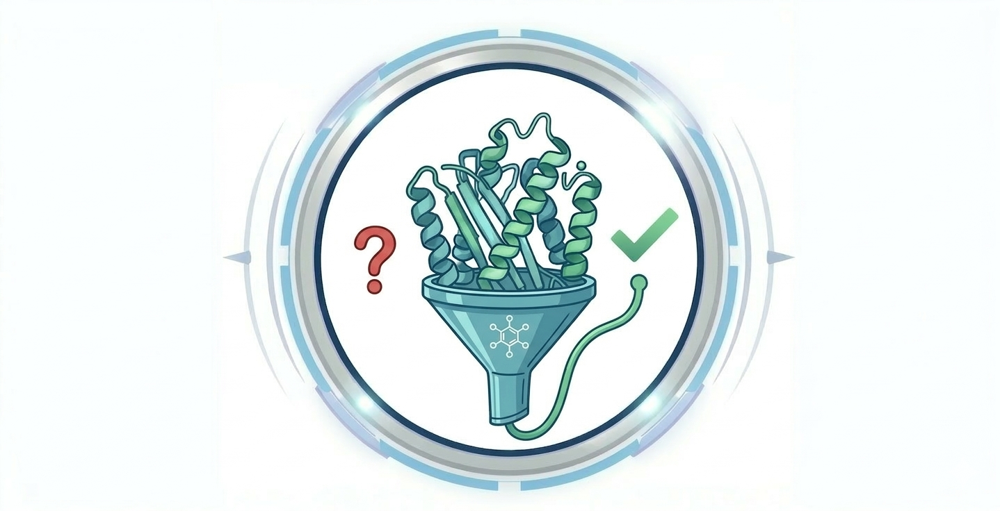
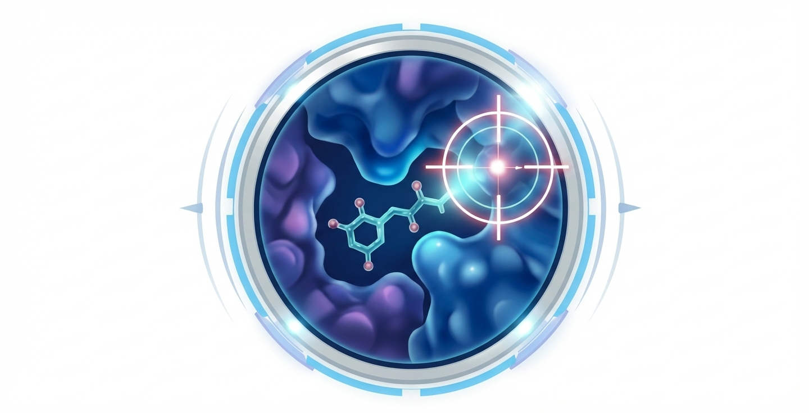
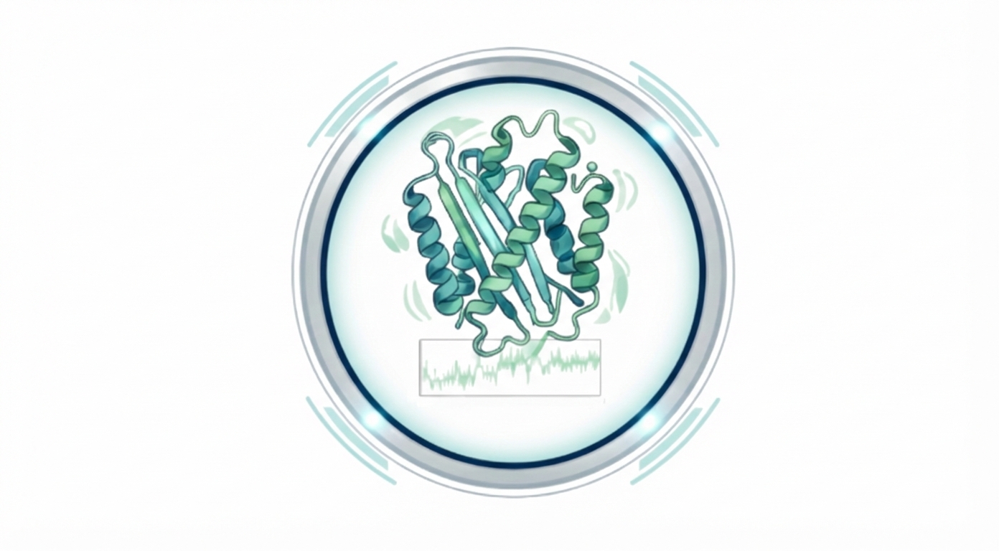
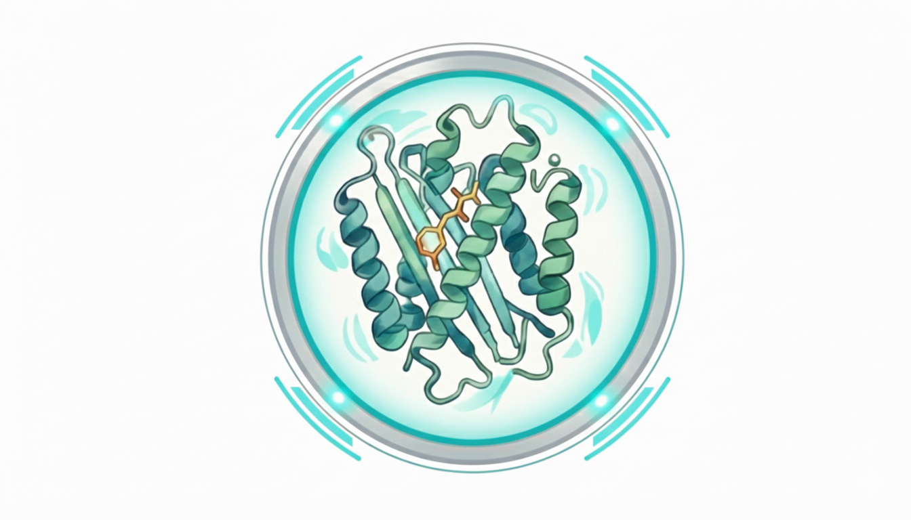
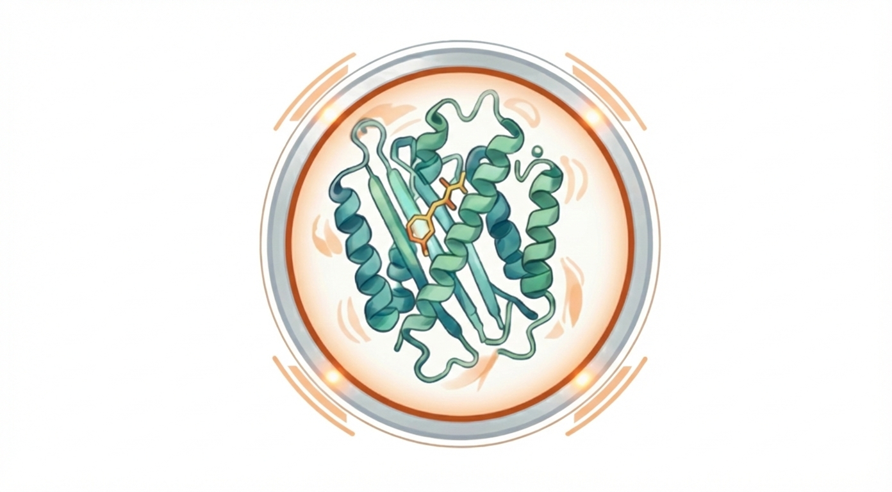
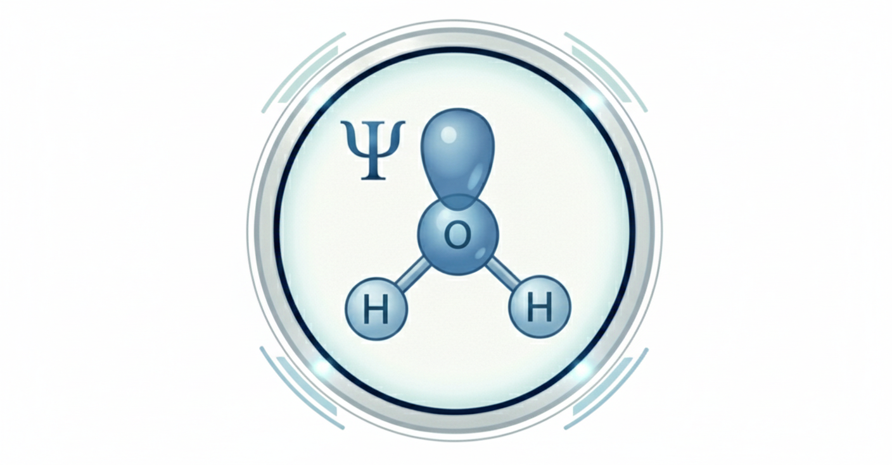
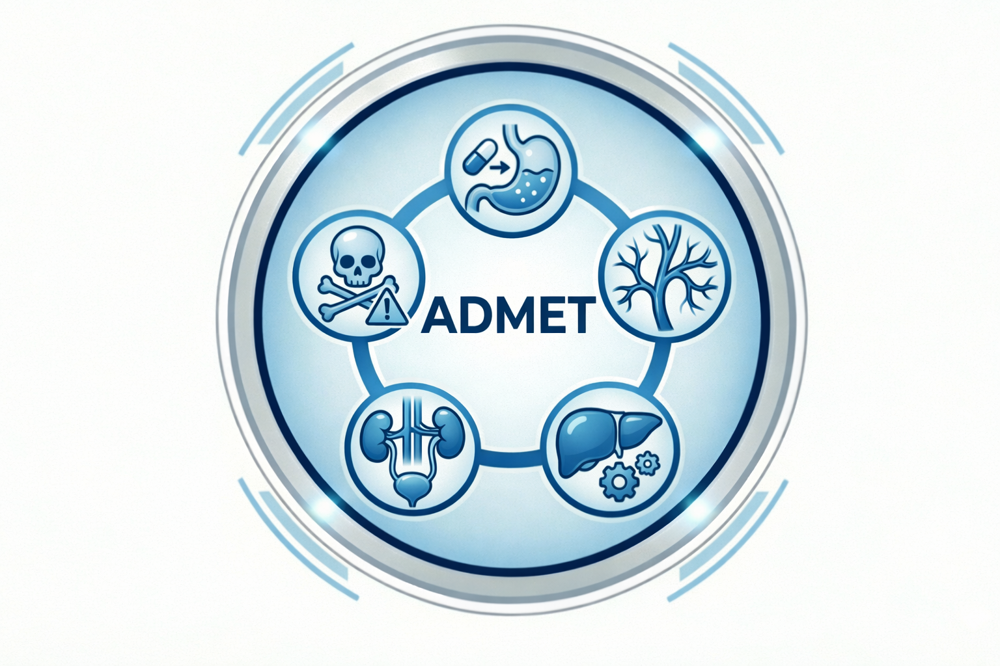

### Project Overview

Ligand-X is a comprehensive web-based platform for molecular structure analysis, visualization, and computational chemistry workflows. It serves as a bridge between complex computational chemistry tools and researchers, providing a suite of microservices for cheminformatics and bioinformatics simulation, all accessible through a modern, intuitive web interface. The application supports multiple file formats (PDB, CIF, mmCIF, SDF), integrates with the RCSB PDB database, and features an interactive molecular editor and viewer, powered by Ketcher and Mol* respectively.

### Key Features

Ligand-X offers tools for every stage of the computer aided drug discovery pipeline, executed locally on your machine using battle tested methodologies:

<!-- Protein Cleaning -->

    

        

            
        

        

            <h4>Structure Cleaning</h4>
            
Automated preparation of raw PDB structures, including protonation and residue repair.

        

        

            <a href="/blog/protein-cleaning-theory" class="button tiny radius secondary">Theory</a>
            <a href="/portfolio/ligand-x/protein-cleaning-demo" class="button tiny radius">Demo</a>
        

    

<!-- Molecular Docking -->

    

        

            
        

        

            <h4>Molecular Docking</h4>
            
High-throughput ligand pose prediction and affinity scoring using AutoDock Vina.

        

        

            <a href="/blog/molecular-docking-theory" class="button tiny radius secondary">Theory</a>
            <a href="/portfolio/ligand-x/molecular-docking-demo" class="button tiny radius">Demo</a>
        

    

<!-- Molecular Dynamics -->

    

        

            
        

        

            <h4>Molecular Dynamics</h4>
            
GPU-accelerated simulations with OpenMM to study complex biological movements.

        

        

            <a href="/blog/molecular-dynamics-theory" class="button tiny radius secondary">Theory</a>
            <a href="/portfolio/ligand-x/molecular-dynamics-demo" class="button tiny radius">Demo</a>
        

    

<!-- Relative Binding Free Energy (RBFE) -->

    

        

            
        

        

            <h4>Relative Binding Free Energy (RBFE)</h4>
            
Compare binding affinities across a series of ligands using network-based alchemical calculations.

        

        

            <a href="/blog/rbfe-theory" class="button tiny radius secondary">Theory</a>
            <a href="/portfolio/ligand-x/rbfe-demo" class="button tiny radius">Demo</a>
        

    

<!-- Absolute Binding Free Energy (ABFE) -->

    

        

            
        

        

            <h4>Absolute Binding Free Energy (ABFE)</h4>
            
Calculate the exact binding affinity of a single ligand to a protein target with rigorous thermodynamic methods.

        

        

            <a href="/blog/abfe-theory" class="button tiny radius secondary">Theory</a>
            <a href="/portfolio/ligand-x/abfe-demo" class="button tiny radius">Demo</a>
        

    

<!-- Quantum Chemistry -->

    

        

            
        

        

            <h4>Quantum Chemistry</h4>
            
Detailed electronic analysis and ligand parameterization using DFT calculations.

        

        

            <a href="/blog/quantum-chemistry-theory" class="button tiny radius secondary">Theory</a>
            <a href="/portfolio/ligand-x/quantum-chemistry-demo" class="button tiny radius">Demo</a>
        

    

<!-- ADMET Prediction -->

    

        

            
        

        

            <h4>ADMET Prediction</h4>
            
Predict molecular properties and ADMET characteristics for drug-likeness assessment.

        

        

            <a href="/portfolio/ligand-x/" class="button tiny radius secondary">Learn More</a>
        

    

### Technical Stack

| Layer | Technologies |
|-------|--------------|
| **Frontend** | React, Next.js, TypeScript, Mol* (3D visualization), Ketcher (molecular editor) |
| **Backend** | FastAPI, Celery, RabbitMQ, Redis, PostgreSQL |
| **Chemistry** | RDKit, AutoDock Vina, OpenMM, OpenFF, ORCA, OpenFE, Boltz-2 |
| **Deployment** | Docker Compose, Conda, CUDA support |

### Architecture

Ligand-X uses a modular microservices architecture where each computational task runs in its own isolated service:

- **Structure Service**: Handles PDB/SDF parsing, component identification, and structure cleaning
- **Docking Service**: Manages molecular docking workflows with AutoDock Vina
- **MD Service**: Orchestrates molecular dynamics simulations with OpenMM
- **QC Service**: Manages quantum chemistry calculations with ORCA
- **ADMET Service**: Predicts molecular properties and drug-likeness
- **Alignment Service**: Performs protein structure alignment
- **Ketcher Service**: Provides interactive molecular editing
- **Boltz-2 Service**: AI-based binding affinity predictions

Each service can be deployed independently, allowing you to use only the tools you need. The gateway coordinates requests across services and manages job queuing through Redis and Celery workers.

### Getting Started

Ligand-X is containerized with Docker for easy deployment. Simply clone the repository, from there you can use `make build` to build the Docker images, and `make up` to start all services. If you are going to be making changes to the code, you should use `make dev` to start all services in development mode, with frontend hot reload enabled. 

The application will be available at `http://localhost:3000` \\
with the API gateway at `http://localhost:8000`. \\
the rabbitmq management interface will be available at `http://localhost:15672`. \\
the celery workers will be available at `http://localhost:5555/workers/`. 

authentication can be setup using environment variables. 

For detailed setup instructions, refer to the Ligand-X documentation on the github page:

    

### Other Projects

